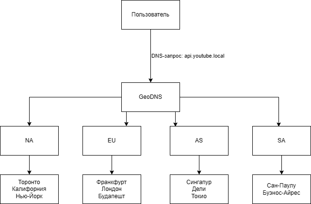

# Расчётно-пояснительная записка видеохостинга формата YouTube
## Описание и аналоги
### Описание
Проектируемый сервис — высоконагруженная платформа для хранения, обработки и потоковой передачи видеоконтента пользователям по всему миру.

Ключевые особенности системы (MVP):

* загрузка видео пользователями
* автоматическая обработка видео
* создание каналов
* подписки на каналы
* лайки, комментарии, просмотры
* сбор статистики

Когда пользователь загружает видео, оно отправляется на сервер по частям — чанками:
* видео разбивается на фрагменты фиксированного размера (например, 5–10 МБ)
* каждый фрагмент загружается отдельно
* сервер подтверждает получение каждого чанка
* после загрузки всех чанков видео собирается

Сервис должен обеспечивать:

* минимальную задержку при старте воспроизведения
* устойчивость к пиковым нагрузкам

### Аналоги

Крупнейшие решения на рынке видеохостинга:

* [TikTok](https://www.tiktok.com/) — короткие вертикальные видео с сильной рекомендательной системой
* [Vimeo](https://vimeo.com/) — платформа для профессионального контента
* [Rutube](https://rutube.ru/) — российский видеохостинг

## Аудитория
### Описание аудитории

Основная аудитория — пользователи от 12 до 60 лет.

Ключевые группы:

* зрители развлекательного контента
* обучающиеся (курсы, туториалы, лекции)
* авторы видео (блогеры, студии, компании)

### Местоположение аудитории

Платформа ориентирована на:

* глобальный рынок
* распределённую географию пользователей
* наличие дата-центров в разных регионах мира

### Размер аудитории
Для расчётной модели принимаем:

* MAU (месячная аудитория): 2.7 млрд пользователей [[1](https://www.aboutchromebooks.com/youtube-statistics-and-user-trends)]
* DAU (дневная активная аудитория): 122 млн пользователей [[1](https://www.aboutchromebooks.com/youtube-statistics-and-user-trends)]
* На платформу загружается около 900 часов видео каждую минуту [[5](https://thumbnailtest.com/stats/youtube/)]
* В среднем пользователь смотрит 9 видео за сессию [[5](https://thumbnailtest.com/stats/youtube/)]
* 5.76 млн видео загружаются ежедневно [[5](https://thumbnailtest.com/stats/youtube/)]
* Средняя длина видео на YouTube примерно 11,7 минут [[2](https://www.globalmediainsight.com/blog/youtube-users-statistics)]
* Пользователи в среднем смотрят видео около 19–30 минут в день [[3](https://affmaven.com/ru/youtube-statistics)]
* 5 млрд просмотров в сутки [[3](https://affmaven.com/ru/youtube-statistics)]

## Распределение нагрузки
### Геораспределение
Минимально:

* Северная Америка
* Европа
* Азия
* Южная Америка

# Расчет нагрузки

## Расчет нагрузки на просмотр видео

### Суммарное время просмтра в сутки (пик)

DAU = 122 млн, среднее время просмотра = 30 минут [[1](https://www.aboutchromebooks.com/youtube-statistics-and-user-trends)]

```
122 000 000 × 30 минут = 3 660 000 000 минут в день (61 млн часов в сутки)
```

### Среднее количество одновременных зрителей

```
61 000 000 / 24 ≈ 2 540 000 часов просмотра в час
```

С учётом пиков (вечерние часы ×2) до 5 млн одновременных зрителей

### Сетевой трафик

Судя по источнику [4] имеем битрейт и разрешение:

| Разрешение  | Средний битрейт (Мбит/с)| Примерный объем за час (ГБ/ч) |
|-------------|-------------------------|-------------------------------|
| 720p        | 1.5-6.0                 | 1.2-2.7                       | 
| 1080p       | 3.0-9.0                 | 2.5-4.1                       |
| 1440p       | 6.0-18.0                | 4.0-5.1                       |
| 4K          | 13.0-51.0               | 5.5-23.0                      |

При этом 85% просмтров в HD+ качестве [6]. Значит большая часть трафик лежит в диапазоне битрейта 3-9 Мбит.

Предположим, что в таком случае средний битрейт - 7 Мбит/с:

```
5 000 000 × 7 Мбит/с = 35 000 000 Мбит/с = 35 Тбит/с
```

При этом объем видео за час будет около 3 Гб.

## Нагрузка на загрузку видео

### Объем загрузкиc

```
900 × 60 = 54 0000 часов в час
54 000 × 24 = 1296000 часов в сутки
```

### Хранение видео

```
1296000 × 3 = 3888000 Гб = 3888 Тб = 3.9 Пб в сутки
```

## Нагрузка на API (RPS)

Сначала ответим на вопрос, сколько видео смотрит один пользователь в день:

```
5 000 000 000 / 122 000 000 = 41 видео в день
```

Если среднее время просмтра 30 минут, то

```
30 минут / 41 = 44 секунды (среднее удержание на видео)
```

Рассчитаем минимальную API-нагрузку на старт видео

```
5 000 000 000 / 86 400 = 58 000 новых просмотров в секунду
```

Каждое видео требует:

* 1 запрос получения метаданных
* 1 запрос на старт стрима
* 1 событие логирования

Также учтем телеметрию. Большинство видеоплатформ отправляют heartbeat каждые 5-15 секунд. Положим, что на Youtube этот показатель равен 10 секундам:

```
44 / 10 = 4 события
```

Тогда RPS будет равен:

```
58 000 x (3 + 4) = 406 000 RPS
```

Тогда пиковый RPS будет в два раза больше:

```
406 000 x 2 = 814 000 RPS (PEAK)
```

## Нагрузка на транскодирование

Если каждое видео (3.6 млн в сутки) кодируется в 5 форматов, то:

```
3 600 000 × 5 = 18 000 000 задач транскодирования в сутки (208 задач в секунду)
```

## Сводная таблица

| Продуктовая метрика          | Значение            |
|------------------------------|---------------------|
| DAU                          | 122 млн             |
| Одновременные пользователи   | 5 млн (пик)         |
| Трафик                       | ~35 Тбит/с          |
| Новых видео в сутки          | ~3.6 млн            |
| Новых данных в сутки         | ~3.9 ПБ             |
| API нагрузка                 | ~406 тыс RPS        |
| Задач транскодирования       | ~18 млн/сутки       |

# Глобальная балансировка нагрузки

## Функциональное разбиение нагрузки

### Действия на запросы

| Действие              | Запрос                    | Описание запроса             | Ограничения / особенности |
| --------------------- | ------------------------- | ---------------------------- | ------------------------- |
| Старт просмотра видео | Получение метаданных      | Чтение информации о видео    | Допустимо кэширование     |
|                       | Получение stream URL      | Генерация подписанной ссылки | Требует авторизации       |
|                       | Логирование старта        | Запись события просмотра     | -                         |
| Просмотр видео        | Heartbeat                 | Передача прогресса просмотра | Высокочастотный           |
| Главная страница      | Получение рекомендаций    | Получение случайных видео    | Низкая задержка           |
|                       | Информация о пользователе | Чтение профиля               | Требуется консистентность |
| Поиск                 | Поиск видео               | Запрос к search-кластеру     | Высокая CPU нагрузка      |
| Лайк/комментарий      | Запись события            | Модификация БД               | Асинхронная репликация    |

### Разбиение доменов

| Запрос                         | Домен                |
| ------------------------------ | -------------------- |
| API                            | api.youtube.local    |
| Поиск                          | search.youtube.local |
| Видео-контент (CDN)            | cdn.youtube.local    |
| Статические файлы              | static.youtube.local |
| События/логирование            | events.youtube.local |

## Расположение ДЦ

Возьмем по несколько ДЦ в каждом регионе

| Регион           | Количество ДЦ |
| ---------------- | ------------- |
| Северная Америка | 3             |
| Европа           | 3             |
| Азия             | 3             |
| Южная Америка    | 2             |


Берем размещение 11 датацентров:

* Торонто, Калифорния, Нью-Йорк (Северная Америка)

* Франкфурт, Лондон, Будапешт (Европа)

* Сингапур, Дели, Токио (Азия)

* Сан-паулу, Буэнос-Айрес (Южная Америка)

## Распределение запросов по датацентрам

Исходные данные:

* Peak API ≈ 812 000 RPS

* Peak видеотрафик ≈ 35 Тбит/с

* Peak одновременные пользователи ≈ 5 млн

Распределение аудитории [2]:

| Регион        | Доля |
| ------------- | ---- |
| США           | 30%  |
| Европа        | 27%  |
| Азия          | 33%  |
| Южная Америка | 10%  |

### API нагрузка по ДЦ

| Регион        | RPS     |
| ------------- | ------- |
| США           | 243 600 |
| Европа        | 219 240 |
| Азия          | 267 960 |
| Южная Америка | 81 200  |

### Видеотрафик по ДЦ

| Регион        | Трафик (Тбит/с) |
| ------------- | --------------- |
| США           | 10.5            |
| Европа        | 9.45            |
| Азия          | 11.55           |
| Южная Америка | 3.5             |

## Схема DNS-балансировки (GeoDNS)



## Схема Anycast-балансировки (CDN)


## Модель балансировки

### DNS-балансировка (GeoDNS)

Пользователь отправляется в ближайший регион, используются маршруты, обеспечивающие минимальную задержку.

### Anycast для CDN

Один IP объявляется из нескольких регионов, BGP выбирает ближайший маршрут, BGP выбирает ближайший маршрут.

### Внутренняя балансировка

L4 балансировщики для TCP (видео), L7 балансировщики для API.

## Механизм отказоустойчивости

Если регион недоступен:

* DNS TTL = 60 секунд
* Трафик перераспределяется между соседними регионами
* Перегрузка компенсируется запасом мощности

## Запас по мощности

Сделаем:

```
Capacity = 1.3 x Peak
```

Тогда получим:

```
812 000 x 1.3 = 1 056 000 RPS (API)
35 x 1.3 = 45.5 Тбит/с (Трафик)
```


## Список источников
1. [Youtube Statistics And User Trends In 2025](https://www.aboutchromebooks.com/youtube-statistics-and-user-trends)
2. [YOUTUBE STATISTICS 2026 (DEMOGRAPHICS, USERS BY COUNTRY & MORE)](https://www.globalmediainsight.com/blog/youtube-users-statistics)
3. [Статистика YouTube за 2026 год: ключевые выводы и тенденции](https://affmaven.com/ru/youtube-statistics)
4. [How much data does YouTube actually use?](https://www.androidauthority.com/how-much-data-does-youtube-use-964560/)
5. [YouTube Statistics: Revenue & Growth (2026)](https://thumbnailtest.com/stats/youtube/)
6. [Youtube Video Statistics](https://zipdo.co/youtube-video-statistics/)


