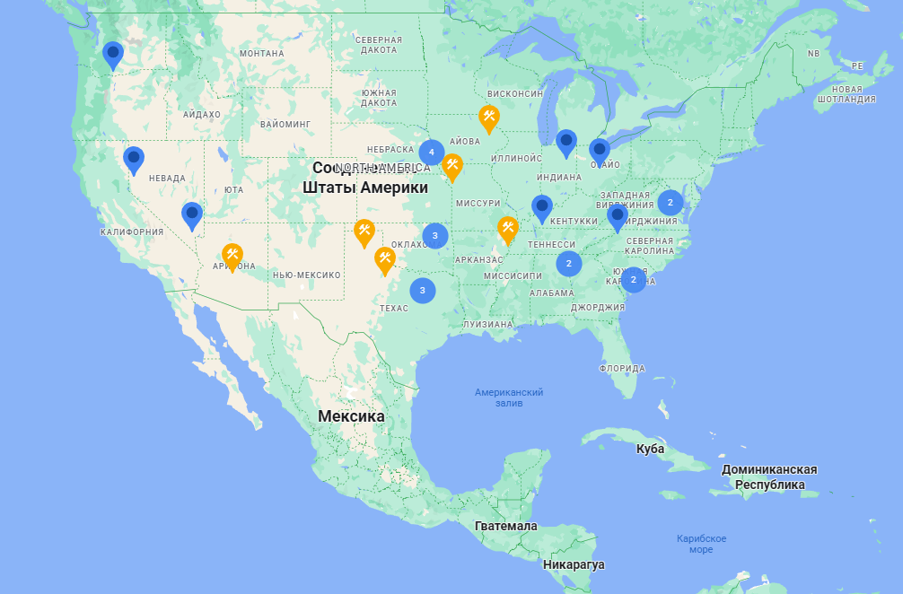
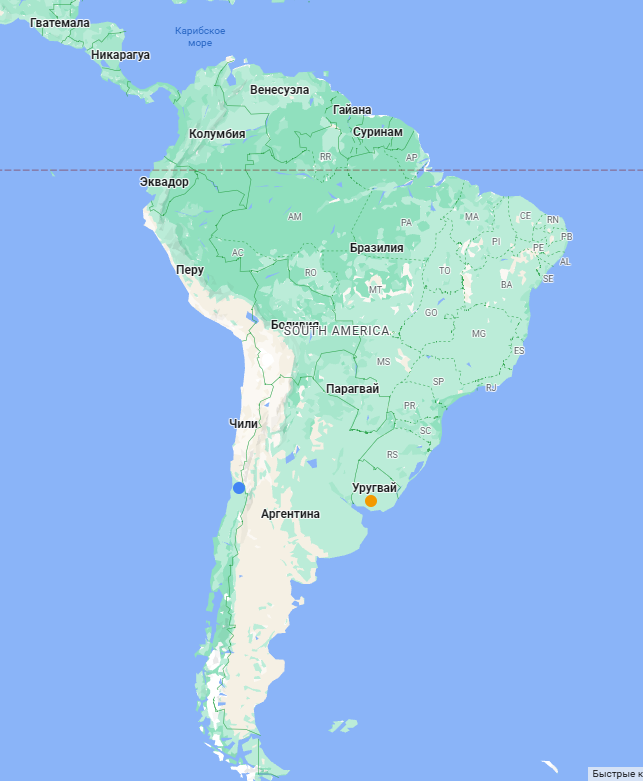
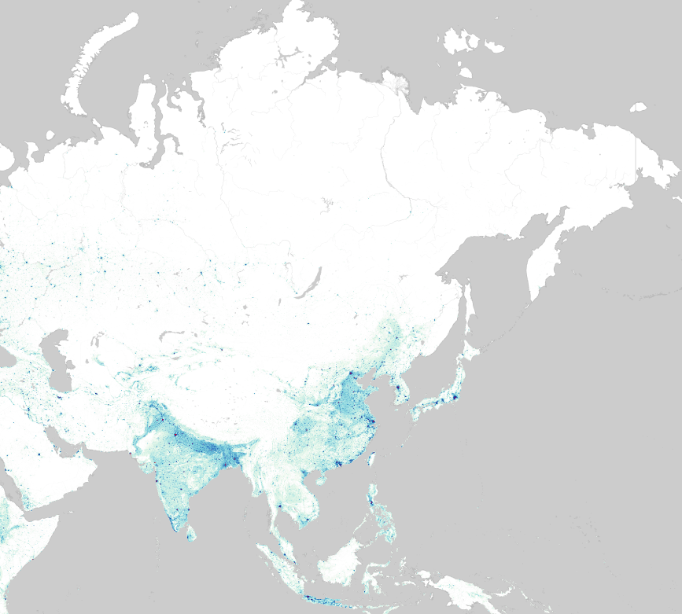

# Расчётно-пояснительная записка видеохостинга формата YouTube
## Описание и аналоги
### Описание
Проектируемый сервис — высоконагруженная платформа для хранения, обработки и потоковой передачи видеоконтента пользователям по всему миру.

Ключевые особенности системы (MVP):

* загрузка видео пользователями
* автоматическая обработка видео
* создание каналов
* подписки на каналы
* лайки, комментарии, просмотры
* сбор статистики

Когда пользователь загружает видео, оно отправляется на сервер по частям — чанками:
* видео разбивается на фрагменты фиксированного размера (например, 5–10 МБ)
* каждый фрагмент загружается отдельно
* сервер подтверждает получение каждого чанка
* после загрузки всех чанков видео собирается

Сервис должен обеспечивать:

* минимальную задержку при старте воспроизведения
* устойчивость к пиковым нагрузкам

### Аналоги

Крупнейшие решения на рынке видеохостинга:

* [TikTok](https://www.tiktok.com/) — короткие вертикальные видео с сильной рекомендательной системой
* [Vimeo](https://vimeo.com/) — платформа для профессионального контента
* [Rutube](https://rutube.ru/) — российский видеохостинг

## Аудитория
### Описание аудитории

Основная аудитория — пользователи от 12 до 60 лет.

Ключевые группы:

* зрители развлекательного контента
* обучающиеся (курсы, туториалы, лекции)
* авторы видео (блогеры, студии, компании)

### Местоположение аудитории

Платформа ориентирована на:

* глобальный рынок
* распределённую географию пользователей
* наличие дата-центров в разных регионах мира

### Размер аудитории
Для расчётной модели принимаем:

* MAU (месячная аудитория): 2.7 млрд пользователей [[1](https://www.aboutchromebooks.com/youtube-statistics-and-user-trends)]
* DAU (дневная активная аудитория): 122 млн пользователей [[1](https://www.aboutchromebooks.com/youtube-statistics-and-user-trends)]
* На платформу загружается около 900 часов видео каждую минуту [[5](https://thumbnailtest.com/stats/youtube/)]
* В среднем пользователь смотрит 9 видео за сессию [[5](https://thumbnailtest.com/stats/youtube/)]
* 5.76 млн видео загружаются ежедневно [[5](https://thumbnailtest.com/stats/youtube/)]
* Средняя длина видео на YouTube примерно 11,7 минут [[2](https://www.globalmediainsight.com/blog/youtube-users-statistics)]
* Пользователи в среднем смотрят видео около 19–30 минут в день [[3](https://affmaven.com/ru/youtube-statistics)]
* 5 млрд просмотров в сутки [[3](https://affmaven.com/ru/youtube-statistics)]

## Распределение нагрузки
### Геораспределение
Минимально:

* Северная Америка
* Европа
* Азия
* Южная Америка

# Расчет нагрузки

## Расчет нагрузки на просмотр видео

### Суммарное время просмтра в сутки (пик)

DAU = 122 млн, среднее время просмотра = 30 минут [[1](https://www.aboutchromebooks.com/youtube-statistics-and-user-trends)]

```
122 000 000 × 30 минут = 3 660 000 000 минут в день (61 млн часов в сутки)
```

### Среднее количество одновременных зрителей

```
61 000 000 / 24 ≈ 2 540 000 часов просмотра в час
```

### Коэффициент липучести

```
SF = DAU/MAU = 122 000 000 / 2 700 000 000 = 0.045 (очень приближенное значение из-за двух разных категорий видео (полноценные/shorts)
```

С учётом пиков (вечерние часы ×2) до 5 млн одновременных зрителей (из-за Индии, самое болшая доля населения, активно пользующаяся Youtube).

### Сетевой трафик

Судя по источнику [4] имеем битрейт и разрешение:

| Разрешение  | Средний битрейт (Мбит/с)| Примерный объем за час (ГБ/ч) |
|-------------|-------------------------|-------------------------------|
| 720p        | 1.5-6.0                 | 1.2-2.7                       | 
| 1080p       | 3.0-9.0                 | 2.5-4.1                       |
| 1440p       | 6.0-18.0                | 4.0-5.1                       |
| 4K          | 13.0-51.0               | 5.5-23.0                      |

При этом 85% просмтров в HD+ качестве [6]. Значит большая часть трафик лежит в диапазоне битрейта 3-9 Мбит.

Предположим, что в таком случае средний битрейт - 7 Мбит/с:

```
5 000 000 × 7 Мбит/с = 35 000 000 Мбит/с = 35 Тбит/с
```

При этом объем видео за час будет около 3 Гб.

## Нагрузка на загрузку видео

### Объем загрузкиc

```
900 × 60 = 54 000 часов в час
54 000 × 24 = 1 296 000 часов в сутки
```

### Хранение видео

```
1296000 × 3 = 3888000 Гб = 3888 Тб = 3.9 Пб в сутки
```

## Нагрузка на API (RPS)

Сначала ответим на вопрос, сколько видео смотрит один пользователь в день:

```
5 000 000 000 / 122 000 000 = 41 видео в день
```

Если среднее время просмтра 30 минут, то

```
30 минут / 41 = 44 секунды (среднее удержание на видео)
```

Рассчитаем минимальную API-нагрузку на старт видео

```
5 000 000 000 / 86 400 = 58 000 новых просмотров в секунду
```

Каждое видео требует:

* 1 запрос получения метаданных
* 1 запрос на старт стрима
* 1 событие логирования

Также учтем телеметрию. Большинство видеоплатформ отправляют heartbeat каждые 5-15 секунд. Положим, что на Youtube этот показатель равен 10 секундам:

```
44 / 10 = 4 события
```

Тогда RPS будет равен:

```
58 000 x (3 + 4) = 406 000 RPS
```

Тогда пиковый RPS будет в два раза больше:

```
406 000 x 2 = 814 000 RPS (PEAK)
```

## Нагрузка на транскодирование

Если каждое видео (3.6 млн в сутки) кодируется в 5 форматов, то:

```
3 600 000 × 5 = 18 000 000 задач транскодирования в сутки (208 задач в секунду)
```

## Сводная таблица

| Продуктовая метрика          | Значение            |
|------------------------------|---------------------|
| DAU                          | 122 млн             |
| Одновременные пользователи   | 5 млн (пик)         |
| Трафик                       | ~35 Тбит/с          |
| Новых видео в сутки          | ~3.6 млн            |
| Новых данных в сутки         | ~3.9 ПБ             |
| API нагрузка                 | ~406 тыс RPS        |
| Задач транскодирования       | ~18 млн/сутки       |

# Глобальная балансировка нагрузки

## Функциональное разбиение нагрузки

### Действия на запросы

| Действие              | Запрос                    | Описание запроса             | Ограничения / особенности |
| --------------------- | ------------------------- | ---------------------------- | ------------------------- |
| Старт просмотра видео | Получение метаданных      | Чтение информации о видео    | Допустимо кэширование     |
|                       | Получение stream URL      | Генерация подписанной ссылки | Требует авторизации       |
|                       | Логирование старта        | Запись события просмотра     | -                         |
| Просмотр видео        | Heartbeat                 | Передача прогресса просмотра | Высокочастотный           |
| Главная страница      | Получение рекомендаций    | Получение случайных видео    | Низкая задержка           |
|                       | Информация о пользователе | Чтение профиля               | Требуется консистентность |
| Поиск                 | Поиск видео               | Запрос к search-кластеру     | Высокая CPU нагрузка      |
| Лайк/комментарий      | Запись события            | Модификация БД               | Асинхронная репликация    |

### Разбиение доменов

| Запрос                         | Домен                |
| ------------------------------ | -------------------- |
| API                            | api.youtube.local    |
| Поиск                          | search.youtube.local |
| Видео-контент (CDN)            | cdn.youtube.local    |
| Статические файлы              | static.youtube.local |
| События/логирование            | events.youtube.local |
| Загрузка видео | upload.youtube.local |

## Расположение ДЦ

Предлагаю сначла взглянуть на распределение аудитории [2] и посчитать все необходимые параметры:

| Регион        | Доля |
| ------------- | ---- |
| США           | 30%  |
| Европа        | 27%  |
| Азия          | 33%  |
| Южная Америка | 10%  |

### API нагрузка по ДЦ

| Регион        | RPS     |
| ------------- | ------- |
| США           | 243 600 |
| Европа        | 219 240 |
| Азия          | 267 960 |
| Южная Америка | 81 200  |

### Видеотрафик по ДЦ

| Регион        | Трафик (Тбит/с) |
| ------------- | --------------- |
| США           | 10.5            |
| Европа        | 9.45            |
| Азия          | 11.55           |
| Южная Америка | 3.5             |

### Анализ расположения

Нетрудно заметить, что количество RPS и трафика - огромные. В таком случае можно не изобретать велосипед. 
Можно позаимствовать расположение датацентров у компании, у которой RPS и трафик еще выше, чем у Youtube - Google.
Проанализируем карту датацентров Google и распределения населения по регионам.

#### Северная Америка




Не трудно догадаться, что США - самая богатая страна на дата-центры Google. Но нам не нужно использовать здесь все сервера.
Предположим, что мы используем очень мощные сервера, которые выдерживает огромную нагрузку RPS и трафика.

Также предположим, что "оранжевые" сервера (в разработке) на самом деле уже существуют.

По плотности населения заметим, что Мексика сильно более заселенная, чем Канада.

В таком случае логично взять четыре следующих сервера: штат Невада, штат Техас, штат Алабама и штат Огайо.
Тогда эти сервера смогут покрыть полностью всю Северную Америку и механизмы fallback'а точно будут обеспечены.

#### Южная Америка




На Южную Америку приходится наименьшая доля пользователей. Google имеет здесь только два дата-центра: Канелонес, Уругвай 
(в разработке) и Сантьяго, Чили (рабочий). Берем два сервера в тех же локациях.

#### Европа


Из распределения населения видим, что Центральная Европа и Британия заселены больше всего. Для Британии выделим сервер в Уолтем Кросс, Англия.
Для основной части Европы возьмем два Сервера Сен-Гилен (Бельгия) и Ханау (Германия). Также выделим один сервер под Скандинавскую часть Европы - Хамина (Финляндия).

#### Азия




Также берем сервера по распределению населения: Андхра-Прадеш (Индия), Чонбури (Тайланд), Индзай (Япония) и Сингапур.
Датацентр в Тайване не обязателен, потому что по идее он должен обеспечивать Китай, но в Китае ютубом обычно не пользуются.

### Итог

| Регион           | Количество ДЦ |
|------------------|---------------|
| Северная Америка | 4             |
| Европа           | 4             |
| Азия             | 4             |
| Южная Америка    | 2             |

## Распределение запросов по датацентрам

Исходные данные:

* Peak API ≈ 812 000 RPS

* Peak видеотрафик ≈ 35 Тбит/с

* Peak одновременные пользователи ≈ 5 млн

## Схема DNS-балансировки (GeoDNS)


## Схема Anycast-балансировки (CDN)


## Модель балансировки

### DNS-балансировка (GeoDNS)

Так как просмотр видео не требователен к задержке (ping), то мы можем спокойно жертвовать несколькими мс задержки ради сохранения материальной выгоды.
Из-за высокой задержки может теряться трафик, но в наше время это не принципиально, так как современные провайдеры предоставляют трафик пользователям с большим запасом для просмтра видео.

### Fallback-механизмы

С Америкой и Западной, Центральной и Восточной частями Европы все довольно просто - если ДЦ перегружен, то мы отправляем пользователя в ближайший по линиям GeoDNS маршрутов ДЦ.

С Британскими и Скандинавскими островами, а так же с островной Азией все посложнее:

* Для Скандинавских и Британских островов в приоритете нужно нагружать именно их сервера, так они являются отдельными островами. Бельгийский и Германский сервера работают по стандартному GeoDNS и минимально общаются с Дублином и Хаминой. Финский сервер также может обеспечивать Восточную Европу.
* Для Азии аналогичная ситуация (из-за Японии и Сингапура).

### Anycast для CDN

При использовании Anycast несколько датацентров анонсируют один и тот же IP-адрес через BGP. Интернет автоматически направляет пользователя к ближайшему по сетевой метрике датацентру.

CDN хранит:

* сегменты видео (chunks)
* превью и постеры
* статические файлы интерфейса
* популярные видео

Видео хранится в виде небольших сегментов (2-10 секунд), что позволяет CDN эффективно кэшировать контент и быстро переключать качество.

# Локальная балансировка нагрузки

## Схема балансировки нагрузки


## Пояснения к схеме

L4 балансировка выполняется средствами облачного провайдера или аппаратными балансировщиками.

Причины использования L4:

* высокая пропускная способность
* минимальная задержка
* завершение TCP-соединения
* защита от перегрузки

L4 балансировщик распределяет соединения между L7 балансировщиками.

На втором уровне используется L7 балансировка (Nginx / Envoy).

Она выполняет:

* завршение SSL-соединения
* маршрутизацию запросов
* ограничение частоты запросов
* авторизацию
* кеширование небольших объектов

Для обеспечения резервирования будем использовать схему N * 1.5.

## Расчет количества балансировщиков

| Характеристика                       | Значение   |
|--------------------------------------|------------|
| Пиковый RPC                          | 812 000    |
| Пиковый API RPS                      | 58 000     |
| Пиковая нагрузка                     | 35 Тбит/c  |
| Пропускная способность сервера       | 0.1 Тбис/с |
| RPS Nginx [7]                        | 600 000    |
| Падение пропускной способности Nginx | 15%        |

$$
  Итоговое\ количество\ серверов = max(\frac{Пиковая\ нагрузка}{Ожидаемая\ пропускная\ способность\ сервера}; \frac{Пиковый\ RPC}{Nginx\ RPC\ HTTPS})
$$

У нас используется 14 дата-центров, тогда трафик будет на один будет равен:

$$
Traffic_{DC} = \frac{35}{14} = 2.5 Тбит/с
$$

Пропускная способность сервера с учетом потерь:

$$
Пропускная способность сервера = 0.85 * 0.1 = 0.085 Тбит/с
$$

Тогда расчет по пропускной способности:

$$
Servers_{Пропускная способность сервера} = \frac{2.5}{0.085} = 30
$$

По RPS:

$$
Servers_{RPS} = \frac{58000}{600000} = 1
$$

Тогда получаем 30 серверов. По учету отказоустойчивости - 45.

Итоговая сводная таблица:

| Характеристика                                                         |     Значение |
|:-----------------------------------------------------------------------|-------------:|
| Ожидаемая пропускная способность сервера                               | 0.085 Тбит/с |
| Количество серверов необходимое для обеспечения пропускной способности |           30 |
| Количество серверов, необходмое для обеспечения RPC                    |            1 |
| Итоговое количество серверов                                           |           30 |
| Итоговое количество серверов с учётом резервирования N * 1.5           |           45 |

## Список источников
1. [Youtube Statistics And User Trends In 2025](https://www.aboutchromebooks.com/youtube-statistics-and-user-trends)
2. [YOUTUBE STATISTICS 2026 (DEMOGRAPHICS, USERS BY COUNTRY & MORE)](https://www.globalmediainsight.com/blog/youtube-users-statistics)
3. [Статистика YouTube за 2026 год: ключевые выводы и тенденции](https://affmaven.com/ru/youtube-statistics)
4. [How much data does YouTube actually use?](https://www.androidauthority.com/how-much-data-does-youtube-use-964560/)
5. [YouTube Statistics: Revenue & Growth (2026)](https://thumbnailtest.com/stats/youtube/)
6. [Youtube Video Statistics](https://zipdo.co/youtube-video-statistics/)
7. [Nginx benchmarks](https://openbenchmarking.org/test/pts/nginx)


